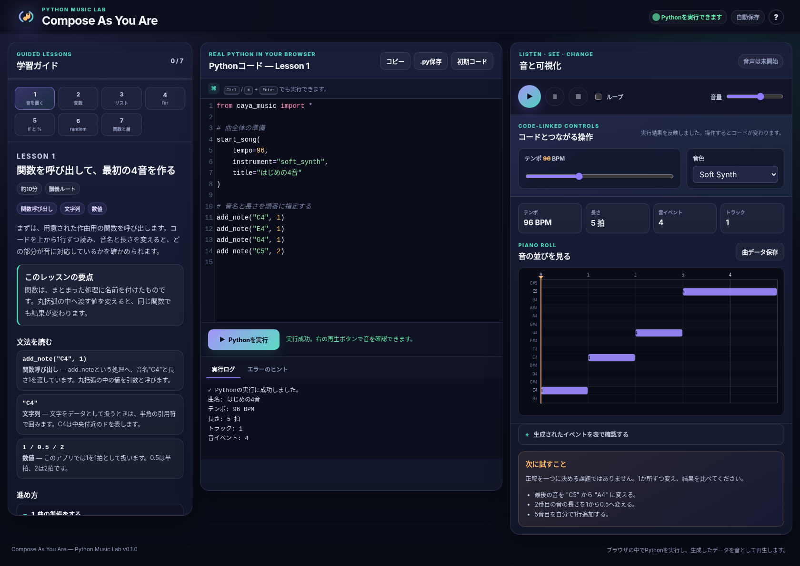

# Compose As You Are

**Python Music Lab**

Pythonの基礎文法を読み、書き換え、実行しながら、自分のコードで音楽を作るブラウザ教材です。インストールやアカウント作成を行わず、GitHub Pages上で利用できます。



## 学べること

アプリ内の7つのレッスンを通して、次の内容を段階的に扱います。

1. 関数呼び出し、文字列、数値
2. 変数と代入
3. リスト、添字、`len`
4. `for`、`range`、インデント
5. `if`、`else`、比較、剰余演算子 `%`
6. `import`、`random.choice`、`random.seed`
7. `def`、引数、複数トラック

Pythonコードを実行すると、曲データが作られます。結果は音として再生できるほか、ピアノロールとイベント表でも確認できます。

## 基本的な使い方

1. 左側でレッスンを選び、説明と課題を読みます。
2. 中央のPythonコードを上から読みます。
3. 数値、音名、リスト、条件などを1か所ずつ変更します。
4. **Pythonを実行**を押します。
5. 右側で再生し、音と可視化を確認します。
6. 変更前後の違いを言葉で説明します。

コードはブラウザ内へ自動保存されます。`.py`ファイルと曲データのJSONファイルも保存できます。

## すぐにローカルで確認する

このアプリはWeb Workerを使うため、`index.html`をファイルとして直接開かず、HTTPサーバーから開いてください。

```bash
python3 -m http.server 8000
```

ブラウザで次を開きます。

```text
http://localhost:8000/
```

Node.jsが利用できる場合は、次のコマンドでも同じサーバーを起動できます。

```bash
npm run serve
```

## テスト

追加パッケージをインストールせずに、構文、リンク、教材コード、作曲APIを検査できます。

```bash
npm test
```

個別に実行する場合は次の通りです。

```bash
npm run check
npm run test:js
npm run test:python
```

## Google Colabへ進む

Lesson 7の「Google Colabで続きを作る」から、スターターノートブックを直接開けます。アプリで保存したPythonコードは、`colab/caya_starter.ipynb`で発展させられます。ノートブックでは、同じ作曲APIを使って次の活動を行います。

- Pythonコードによる曲の生成
- ピアノロールの描画
- NumPyによる簡単な音声合成
- データから音への変換
- 独自の作曲関数の設計

[Google Colabでスターターノートブックを開く](https://colab.research.google.com/github/shogo-ishikawa/compose-as-you-are/blob/main/colab/caya_starter.ipynb)

## GitHub Pagesで公開する

リポジトリ名は `compose-as-you-are` を想定しています。

```bash
git init -b main
git add .
git commit -m "Release v0.1.0"
git remote add origin https://github.com/shogo-ishikawa/compose-as-you-are.git
git push -u origin main
```

GitHubのリポジトリ設定で **Pages → Build and deployment → Source** を **GitHub Actions** にすると、`.github/workflows/pages.yml`がサイトを公開します。

公開URLは次の形式です。

```text
https://shogo-ishikawa.github.io/compose-as-you-are/
```

## 主なファイル

```text
.
├── index.html                     アプリ本体
├── assets/
│   ├── css/app.css                画面デザイン
│   ├── js/app.js                  画面全体の制御
│   ├── js/python-worker.mjs       ブラウザ内Python実行
│   ├── js/audio-engine.js         音声再生
│   ├── js/visualiser.js           ピアノロールと表
│   ├── js/lessons.js              7つの学習教材
│   └── python/caya_music.py       教育用作曲API
├── colab/caya_starter.ipynb       Colab発展教材
├── examples/                      Python作例
├── docs/                          学習・授業利用ガイド
└── tests/                         自動テスト
```

## 使用技術

- Pyodide v314.0.3：ブラウザ内のPython実行
- Tone.js v15.1.22：Web Audioによる音声再生
- CodeMirror v5.65.16：Pythonコードエディタ
- Canvas API：ピアノロールの描画
- GitHub Pages：静的サイトの公開

ブラウザへ初めてアクセスした際は、Python実行環境の読み込みに時間がかかることがあります。音声はブラウザの仕様により、利用者が再生ボタンを押した後に有効になります。

## ライセンス

MIT License
