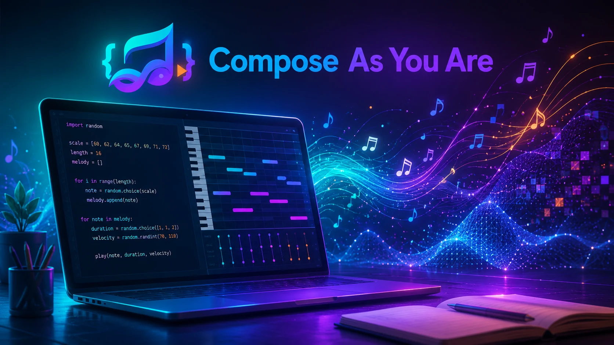

# Compose As You Are

## Python Music Lab

Pythonのコードを読み、書き換え、実行しながら、自分の音楽を作るブラウザ教材です。




## この教材でできること

Compose As You Areには、学び方に応じた3つの入口があります。

- **7つのレッスン**：Pythonの基礎文法を、例題・練習問題・発展問題で段階的に学びます。
- **知識ライブラリ**：Python、自動作曲、音楽、DTMの用語や考え方を確認します。
- **作曲スタジオ**：16ステップのシーケンサーで曲を作り、その内容をPythonコードへ変換します。

## 学ぶ内容

7つのレッスンでは、次の内容を扱います。

1. `def`で自作関数を定義する
2. `import`と変数を使う
3. リストと添字で音をまとめる
4. `for`、`range`、二重ループ、三連符を使う
5. `if`と`else`で休符やアクセントを作る
6. `random`と`seed`で再現できる偶然を作る
7. 関数と複数トラックで作品を編曲する

## 基本の進め方

1. コードを上から読みます。
2. 課題に合わせて、最初は1か所だけ変更します。
3. **Pythonを実行**します。
4. 音を再生し、ピアノロールとイベント表も確認します。
5. なぜ変化したのかをPythonの言葉で説明します。
6. 練習問題や発展問題へ進みます。


練習問題と発展問題は、初期コードから1か所以上変更して実行すると学習記録へ反映されます。コード、進捗、作曲スタジオの状態は、同じブラウザの中へ保存されます。

## 作曲スタジオ

作曲スタジオでは、次の要素を操作できます。

- 旋律と低音の音名
- Kick、Snare、Hi-hat
- 4ステップごとの和音
- テンポと1ステップの長さ
- 三連符
- 音色、音量、左右位置
- 乱数seedからのパターン生成

シーケンサーの内容はPythonコードへ変換されます。生成後のコードは自由に編集でき、`.py`ファイルとして保存できます。

## 音名と長さ

```python
add_note("C4", 1)      # 中央付近のドを1拍
add_note("F#4", 0.5)   # ファのシャープを半拍
add_note("Bb3", 1 / 3) # シのフラットを三連符1個分
```

この教材では、数値の`1`を1拍として扱います。末尾の数字が大きい音名ほど高い音です。

## エラーが起きたとき

Pythonの元のエラーと、日本語の手掛かりを両方表示します。まず次の点を確認してください。

- `for`、`if`、`def`の行末にコロンがあるか
- 次の行が半角スペース4個で字下げされているか
- 文字列を半角の引用符で囲んでいるか
- 変数名のつづりが一致しているか
- リストの添字が要素数の範囲内か

## Google Colabへの発展

Lesson 7からスターターノートブックを開き、アプリで作ったコードを発展させられます。Colabでは、ピアノロールの描画、NumPyによる簡単な音声合成、数値データの可聴化などを試せます。

## 利用上の注意

- 初回はPython実行環境の読み込みに少し時間がかかります。
- 音声は再生ボタンを押した後に有効になります。
- 複数トラックを重ねると音量が上がるため、小さめの音量から始めてください。
- 保存内容は使用中のブラウザ内にあり、別の端末や別のブラウザへ自動では移りません。

## 関連ガイド

- [学習ガイド](./docs/LEARNING_GUIDE.md)
- [Python基礎ガイド](./docs/PYTHON_GUIDE.md)
- [自動作曲ガイド](./docs/AUTOMATIC_COMPOSITION_GUIDE.md)
- [作曲スタジオガイド](./docs/STUDIO_GUIDE.md)
- [Google Colabへの進み方](./docs/COLAB_GUIDE.md)

## ライセンス

MIT License
