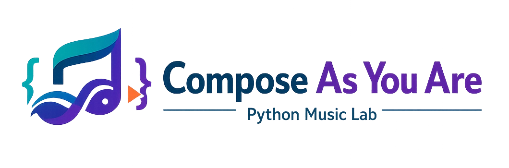

# Compose As You Are

## Python Music Lab · v1.2.0

Pythonを読み、自分で書き、音とデータで確かめるブラウザ教材です。



## 3つの入口

- **レッスン**：notebookやLAVi-SPICAで学んだ文法を音楽へ応用します。
- **知識ライブラリ**：Python、音楽、自動作曲、DTMの用語を確認します。
- **作曲スタジオ**：シーケンサーからPythonコードを生成し、自由に作品へ発展させます。

## 新しい学習経路

| レッスン | 内容 | 位置付け |
|---|---|---|
| 1 | 変数・計算・print | SPICAの第1段階の応用 |
| 2 | リスト・添字・append、辞書・タプル | 第2段階の応用 |
| 3 | for・range、二重ループ | 第3段階の応用 |
| 4 | if・elif・else、休符とアクセント | 第4段階の応用 |
| 5 | def・引数・return、関数の検証 | 第5段階の応用 |
| 6 | random・seed・再現性 | 選択発展。SPICAのNumPy回とは別です |
| 7 | 関数の再利用・複数トラック・小作品 | 選択発展・グループワークへの入口 |

授業では最後に例題を紹介し、興味のあるレッスンを後から深める使い方もできます。全レッスンを授業内で終える必要はありません。各レッスンから対応するSPICAの文法へ戻れます。

## 読む・書く・確かめる

例題は完成コードで考え方を読みます。練習問題と発展問題は、`...`と`# TODO`が示す部分に学生自身がコードを書きます。問題の指示とできあがりの条件は、エディタの近くに表示されます。

1. 問題の目標、書く箇所、確認条件を読みます。
2. 自分で式や処理を書きます。困ったら3段階のヒントを順に開きます。
3. **Pythonを実行・答え合わせ**で、音の順序・開始時刻・長さ・関数の返り値などを確認します。
4. 未達成の項目は期待値と実際の値を比較し、修正します。
5. 解答例は必要なときだけ開き、最後に自分の言葉で説明します。

最後のヒントまで開くと「解答例のコードを見る」が現れます。解答例の表示・コピーはエディタを上書きせず、条件達成にもなりません。PCでは課題・コード・音楽を横に並べ、「音楽パネルを下へ／右へ」で配置を保存できます。テンポと音色の操作は安全に特定できるコードだけを書き換え、実行は自動で行いません。

Python実行環境との接続が切れた場合も入力コードは画面内に保持されます。「Pythonを再準備」を押してから再実行してください。保存警告がある場合は、閉じる前に `.py保存` または学習記録の書き出しも行ってください。

音が出ただけでは条件確認済みになりません。問題に応じて入力値や関数の引数を変える確認も行います。コードを編集すると現在の状態は「編集後・未確認」に戻ります。ヒント・解答例の参照と、条件の達成は別々に記録します。

これは学習用の答え合わせで、試験用の不正対策や理解度の完全な証明ではありません。解答例は公開教材で、最終作品の美しさや独創性は自動採点しません。

## 保存と旧版のコード

新レッスンの下書き、実行結果、参照履歴、振り返りはブラウザへ自動保存します。別の端末へ移るときは「学習記録を保存」で書き出してください。「学習記録を読み込む」で新レッスンの記録を復元できます。

旧レッスンと作曲スタジオの保存データは変更しません。[旧レッスン](./legacy-lessons.html)から以前のコードを開けます。旧版の実行済み記録を、新問題の条件確認済み記録へ自動変換することはありません。

## 音を出さない学習

音声再生なしでも、ピアノロールとイベント表で音数・順序・開始・長さを確認できます。休符はイベントを増やさず時刻を進めるので、開始時刻と曲全体の長さにも注目してください。

## 作曲スタジオとColab

作曲スタジオの旋律・低音・ドラム・和音・音色・音量などの機能は引き続き利用できます。Lesson 7からColabのスターターノートブックへ進めます。

## 関連ガイド

- [学習ガイド](./docs/LEARNING_GUIDE.md)
- [教員向け：学習経路・課題編集・確認方法](./docs/TEACHER_CURRICULUM.md)
- [Python基礎ガイド](./docs/PYTHON_GUIDE.md)
- [作曲スタジオガイド](./docs/STUDIO_GUIDE.md)
- [Google Colabへの進み方](./docs/COLAB_GUIDE.md)

## 開発時の確認

```bash
npm test
npm run serve
```

ブラウザと実際のPyodideを含む回帰確認は `npm run test:browser` で実行します。結果と横／縦配置の画像は `browser-results/` に作られます。

## ライセンス

MIT License
